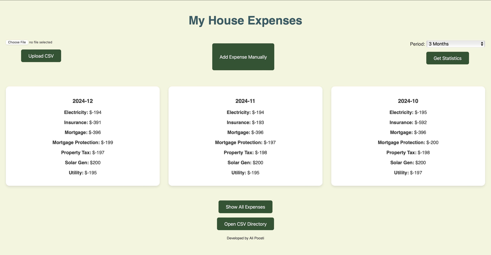

# House Expenses
Web app for managing and visualizing expenses from CSV files using Flask, Pandas, and JavaScript.

This web application allows users to track their expenses using a CSV file. The application enables users to view, filter, and categorize their expenses. The app is built with Flask for the backend, while the frontend is crafted with HTML, CSS, and JavaScript to provide an intuitive user interface. The app also features an interactive grid layout and modal popups for displaying detailed data.

#### How the App Looks



## Tech Stack

- **Backend**: Python, Flask
- **Frontend**: HTML, CSS, JavaScript
- **Libraries**:
  - **Pandas** for data manipulation (reading and processing CSV)
  - **Flask** for the web framework
  - **JavaScript** for dynamic content and data handling

## File Structure

```
root_folder/
│
├── app.py                     # Main Flask application file
├── requirements.txt           # Python dependencies
├── data/                      # Folder containing CSV data
│   └── expenses.csv           # Example expenses CSV file
├── templates/                 # HTML templates
│   └── index.html             # Main HTML page for the web app
├── img/                       # Photo assets
│   └── house.png              # House emoji image
└── README.md                  # This readme file
```

## How to Install Requirements

1. Clone this repository to your local machine.
2. Navigate to the project directory in your terminal.
3. Run the following command to install the required dependencies:

   ```bash
   pip install -r requirements.txt
   ```

   This will install the necessary Python libraries including Flask and Pandas.

## How to Run the App

1. After installing the dependencies, ensure that the `data/expenses.csv` file exists in your project folder (you can use your own CSV file from your Banks, e.g., RBC).
2. Run the Flask application:

   ```bash
   python app.py
   ```

3. The app should now be running on `http://127.0.0.1:5000/`.

## Features

- **View Expense Summary**: The main page displays a grid layout of expenses categorized by month, showing summarized amounts by category.
- **Show All Expenses**: A button allows users to view all detailed expenses in a popup modal, which displays the transaction date, description, amount in CAD, and category.
- **Open CSV File Directory**: A button enables users to open the directory where the expenses CSV file is stored.
- **Date Sorting**: The expenses are sorted by month in descending order (most recent on top).
- **Interactive Interface**: The page layout adjusts dynamically based on the data, and the user interface is responsive.


